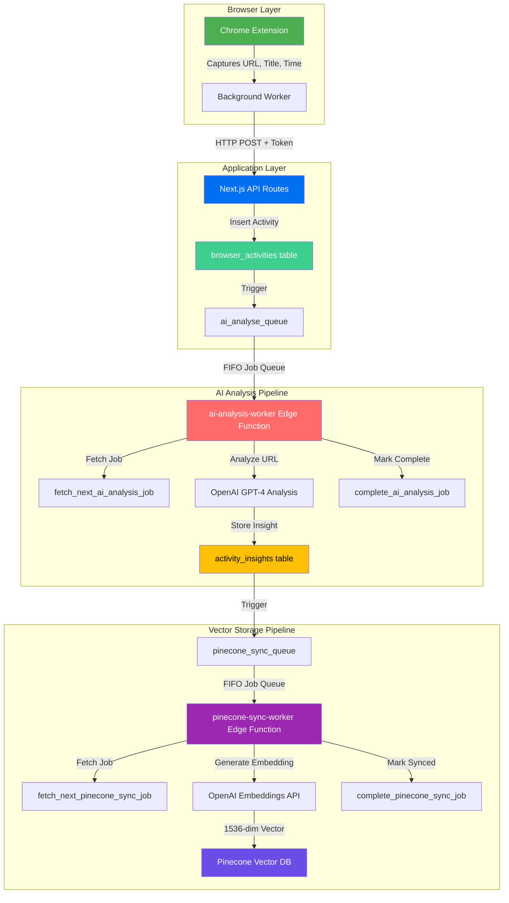
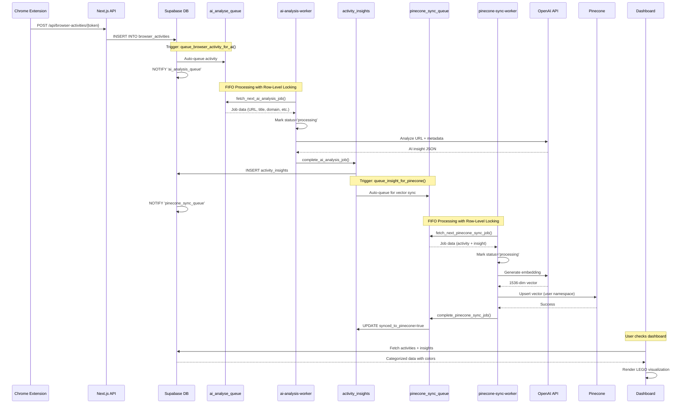
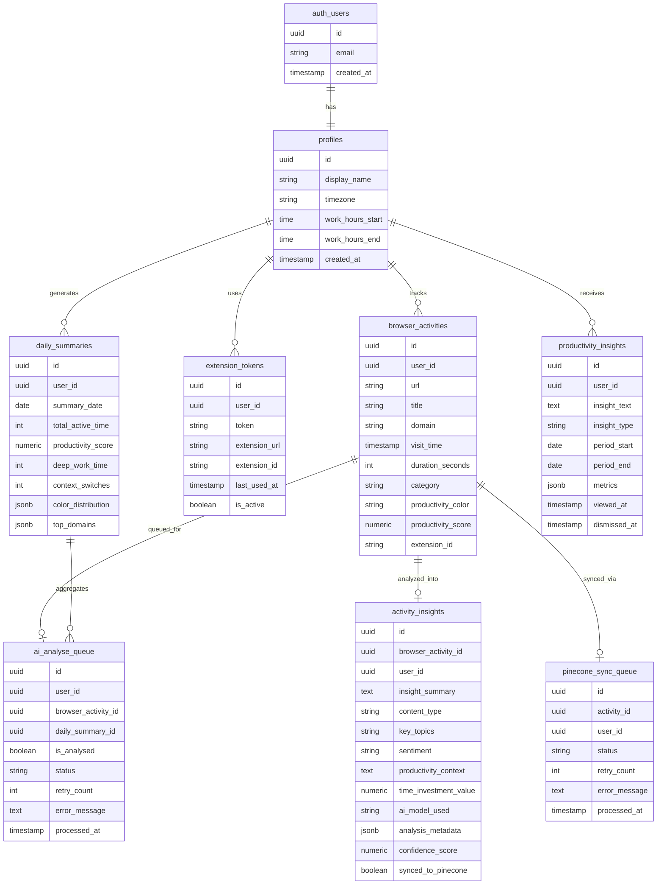
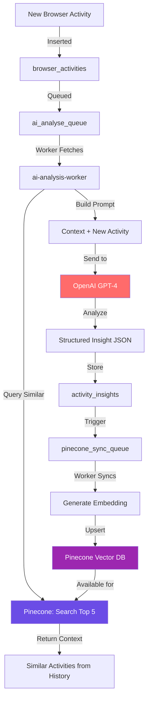

<div align="center">
  
  <h1>Duplo Heart</h1>
  <p><strong>Transform your browser history into a constructive narrative</strong></p>
  
  [](https://nextjs.org/)
  [](https://www.typescriptlang.org/)
  [](https://supabase.com/)
  [](https://www.pinecone.io/)
  [](https://openai.com/)
</div>

<br/>

## 🎯 What is Duplo Heart?

Duplo Heart is **not another productivity tracker** that judges you. It's a **Data Observatory** that understands your digital life through context, not cold numbers.

**Built with LEGO-inspired design principles** and powered by high-fidelity AI analysis, Duplo Heart transforms chaotic browsing patterns into meaningful insights—helping you understand *why* you browse, not just *what* you browse.

---

### ✨ Key Philosophy

- 🚫 **No judgment zones** — Your browsing is yours to understand
- 🧠 **Context over metrics** — Meaning matters more than milliseconds  
- 🧱 **Modular by design** — Build your own data narrative, brick by brick
- 🔒 **Privacy-first** — Your data stays yours, always

---

## 🎯 Vision

**Daily Active Check-in**

We're building a tool so engaging, insightful, and non-judgmental that users *want* to check in daily. Not because of streaks, points, or gamification—but because it genuinely helps them understand their digital selves.

---

## ✨ What Makes Duplo Heart Different?

### 🚫 Anti-Judgment Mandates

- **No diagnostic language** (no "time wasted", "unproductive")
- **No numerical scores** that reduce your day to a number
- **No gamification** (no streaks, no badges, no points)
- **Semantic, not judgmental** color coding
- **Context-aware** insights powered by RAG (Retrieval-Augmented Generation)

### 🎨 The 6-Color Productivity Spectrum

We visualize your browser activity through six distinct colors, each representing a different dimension of digital life:

| Color | Category | Description |
|-------|----------|-------------|
| 🟢 **Green** | Deep Work | Focused creation, learning, building |
| 🔵 **Blue** | Communication | Connecting with others, collaboration |
| 🟡 **Yellow** | Active Rest | Intentional breaks, recharging |
| 🟠 **Orange** | Exploration | Discovery, research, curiosity-driven browsing |
| 🔴 **Red** | Reactive Mode | Context switching, alerts, urgent responses |
| ⚪ **Grey** | Neutral | System tasks, utilities, uncategorized |

### 🧬 High-Fidelity Analysis

Unlike simple URL pattern matching, Duplo Heart uses:
- **Vector embeddings** via Pinecone for semantic understanding
- **Context preservation** across browsing sessions
- **Pattern detection** that learns your unique workflow
- **Tone-validated insights** (warm, constructive, never judgmental)

---

## 🏗️ Architecture

### Complete System Overview



### End-to-End Data Flow (Production)



### Token-Based Authentication Flow


### Job Queue Architecture (FIFO with Retry Logic)

```mermaid
graph TB
    subgraph "AI Analysis Queue"
        A1[New Activity] -->|Trigger| A2[ai_analyse_queue]
        A2 -->|Status: pending| A3{Retry < 3?}
        A3 -->|Yes| A4[fetch_next_ai_analysis_job]
        A4 -->|Row-level LOCK| A5[Mark processing]
        A5 -->|Success| A6[complete_ai_analysis_job]
        A5 -->|Failure| A7[fail_ai_analysis_job]
        A7 -->|retry_count++| A3
        A6 -->|Status: completed| A8[activity_insights]
    end
    
    subgraph "Pinecone Sync Queue"
        B1[New Insight] -->|Trigger| B2[pinecone_sync_queue]
        B2 -->|Status: pending| B3{Retry < 5?}
        B3 -->|Yes| B4[fetch_next_pinecone_sync_job]
        B4 -->|Row-level LOCK| B5[Mark processing]
        B5 -->|Success| B6[complete_pinecone_sync_job]
        B5 -->|Failure| B7[fail_pinecone_sync_job]
        B7 -->|retry_count++| B3
        B6 -->|Status: completed| B8[Synced to Pinecone]
    end
    
    style A4 fill:#FF6B6B,color:#fff
    style B4 fill:#9C27B0,color:#fff
    style A6 fill:#4CAF50,color:#fff
    style B6 fill:#4CAF50,color:#fff
```



---

## 🛠️ Tech Stack

### Frontend
- **Next.js 14** - React framework with App Router
- **TypeScript** - Type-safe development
- **Tailwind CSS** - Utility-first styling
- **Framer Motion** - 60fps animations (transform & opacity only)
- **Rive** - Advanced interactive animations

### Backend
- **Next.js API Routes** - Serverless functions
- **Supabase** - PostgreSQL database with RLS
- **Supabase Auth** - User authentication & management

### AI & Data
- **OpenAI GPT-4** - Natural language analysis
- **OpenAI Embeddings** - Vector generation
- **Pinecone** - Vector database for RAG
- **Zod** - Runtime schema validation

### Browser Extension
- **Manifest V3** - Modern Chrome Extension API
- **Background Service Worker** - Efficient activity tracking
- **Chrome History API** - Access browsing data

---

## 🚀 Quick Start

### Prerequisites

```bash
node >= 18.0.0
npm or yarn
Supabase account
Pinecone account
OpenAI API key
```

### 1. Clone & Install

```bash
git clone <repository-url>
cd duplo-heart
yarn install
```

### 2. Environment Setup

Create `.env.local` in the root directory:

```bash
# Supabase
NEXT_PUBLIC_SUPABASE_URL=your_supabase_url
NEXT_PUBLIC_SUPABASE_ANON_KEY=your_supabase_anon_key
SUPABASE_SERVICE_ROLE_KEY=your_service_role_key

# OpenAI
OPENAI_API_KEY=your_openai_api_key

# Pinecone
PINECONE_API_KEY=your_pinecone_api_key
PINECONE_ENVIRONMENT=your_pinecone_environment
PINECONE_INDEX_NAME=duplo-heart-activities

# Extension
NEXT_PUBLIC_EXTENSION_DOWNLOAD_URL=https://your-extension-url.zip
```

### 3. Database Setup

Run the Supabase migrations:

```bash
# 1. Core schema
psql -h your-db-host -d your-db -f supabase-productivity-schema.sql

# 2. Extension tokens
psql -h your-db-host -d your-db -f supabase-extension-tokens-schema.sql

# 3. Pinecone trigger
psql -h your-db-host -d your-db -f supabase-pinecone-trigger.sql
```

### 4. Run Development Server

```bash
yarn dev
```

Visit [http://localhost:3000](http://localhost:3000)

### 5. Install Chrome Extension

**Option A: Download Pre-built Extension (Recommended)**

1. Set up extension download URL in `.env.local`:
   ```bash
   NEXT_PUBLIC_EXTENSION_DOWNLOAD_URL=https://drive.google.com/uc?export=download&id=YOUR_FILE_ID
   ```

2. Visit your dashboard - click the download button in the Extension Status Bar
3. Install the downloaded `.zip` file:
   - Go to `chrome://extensions/`
   - Enable "Developer mode"
   - Drag and drop the `.zip` file

**Option B: Load Unpacked (Development)**

1. Navigate to `chrome-extension/` directory
2. Update `manifest.json` with your API URL
3. Load unpacked extension in Chrome:
   - Go to `chrome://extensions/`
   - Enable "Developer mode"
   - Click "Load unpacked"
   - Select the `chrome-extension/` folder

**After Installation:**

1. Open the extension popup from your dashboard
2. Copy the generated extension URL (contains your unique token)
3. The extension will automatically start tracking browsing history
4. Sync happens every 5 minutes automatically

---

## 📊 Database Schema

### Complete Entity Relationship Diagram



### Key Database Features

**Triggers (Automatic Workflows):**
1. `trigger_queue_browser_activity_for_ai` - Auto-queues new activities for AI analysis
2. `trigger_queue_insight_for_pinecone` - Auto-queues insights for vector sync
3. `trigger_update_extension_token_last_used` - Tracks token usage

**Helper Functions (FIFO Queue Management):**
1. `fetch_next_ai_analysis_job()` - Locks and returns next AI job
2. `complete_ai_analysis_job()` - Stores insights and marks complete
3. `fail_ai_analysis_job()` - Handles failures with retry logic
4. `fetch_next_pinecone_sync_job()` - Locks and returns next sync job
5. `complete_pinecone_sync_job()` - Marks vector sync complete
6. `fail_pinecone_sync_job()` - Handles sync failures

**Row-Level Security (RLS):**
- All tables have RLS policies ensuring users only access their own data
- Service role key bypasses RLS for edge functions

---

## 🎨 Design System

### LEGO Brick Component

Our core visual metaphor is the LEGO brick:
- **24px minimum border radius** (consistent with DUPLO blocks)
- **Material Design elevation** (0, 2, 4, 8)
- **6-color semantic palette** (no arbitrary colors)
- **Smooth 60fps animations** (transform & opacity only)

### Accessibility

- **WCAG 2.1 AA Compliance**
- Semantic HTML throughout
- Keyboard navigation support
- Screen reader optimized
- High contrast color ratios

### Performance Mandates

```typescript
// ✅ Good - 60fps animations
transform: 'translateY(0)',
opacity: 1,

// ❌ Bad - layout thrashing
width: '100%',
height: '200px',
```

---

## 🧩 MVP Features & Roadmap

### ✅ Phase 1: Foundation (Complete)

- [x] **Chrome Extension** with Manifest V3
  - Background service worker for activity tracking
  - Token-based authentication
  - Extension download button with Google Drive integration
  - Auto-sync browsing history every 5 minutes
- [x] **Next.js Full-Stack Application**
  - App Router with TypeScript
  - Server-side rendering & API routes
  - Authentication flows (login/signup)
  - Protected dashboard routes
- [x] **Supabase Backend**
  - PostgreSQL database with RLS
  - Auth integration
  - Real-time subscriptions ready
- [x] **LEGO-Themed UI Design**
  - 6-color productivity spectrum
  - 24px border radius on all bricks
  - Material Design elevation
  - Framer Motion animations (60fps)
- [x] **Extension Status Bar**
  - Dynamic installation detection
  - Download button with confetti delight
  - Token display and refresh
  - Rive animations for warmth

### ✅ Phase 2: Data Pipeline (Complete)

- [x] **Database Schema**
  - `profiles` - User settings and preferences
  - `browser_activities` - Raw browsing history
  - `extension_tokens` - Secure token management
  - `ai_analyse_queue` - FIFO job queue for AI
  - `activity_insights` - AI-generated insights
  - `pinecone_sync_queue` - FIFO queue for vectors
  - `daily_summaries` - Aggregated daily metrics
  - `productivity_insights` - User-facing insights
- [x] **Database Triggers**
  - Auto-queue activities for AI analysis
  - Auto-queue insights for Pinecone sync
  - Auto-update token last used timestamp
- [x] **Helper Functions**
  - FIFO job fetching with row-level locking
  - Complete/fail job handlers with retry logic
  - PostgreSQL NOTIFY for real-time events

### ✅ Phase 3: AI Integration (IN PROGRESS)

- [x] **AI Analysis Worker** (Supabase Edge Function)
  - FIFO job processing from `ai_analyse_queue`
  - OpenAI GPT-4 integration
  - Structured insight extraction
  - Fallback to rule-based categorization
  - Retry logic (up to 3 attempts)
- [x] **Pinecone Sync Worker** (Supabase Edge Function)
  - FIFO job processing from `pinecone_sync_queue`
  - OpenAI embeddings generation (1536-dim)
  - User-specific namespace isolation
  - Graceful failure handling
  - Retry logic (up to 5 attempts)
- [x] **High-Fidelity Categorization**
  - Context-aware analysis using RAG
  - 6-color semantic mapping
  - Sentiment analysis
  - Time investment value scoring
  - Key topic extraction

### 🚧 Phase 4: Dashboard Visualization (POST MVP PHASE)

- [ ] **Activity Timeline View**
  - Chronological list of browser activities
  - Color-coded by productivity category
  - AI insights display
  - Filter by date range, color, domain
- [ ] **Daily Summary Cards**
  - Total active time
  - Color distribution pie chart
  - Top domains visited
  - Deep work vs. reactive mode breakdown
- [ ] **LEGO Brick Visualization**
  - Interactive brick grid
  - Hover for detailed insights
  - Click for full activity details
  - Smooth animations

### 📋 Phase 5: Advanced Features (POST MVP PHASE)

- [ ] **Productivity Gauge** - Daily health meter
- [ ] **Weekly Tower** - Stacked brick visualization
- [ ] **Historical Baseplate** - Calendar heatmap
- [ ] **Pattern Detection** - Multi-session analysis
- [ ] **Productivity Insights** - Weekly AI summaries
- [ ] **PDF Export** - LEGO instruction manual style
- [ ] **Settings Page** - Work hours, timezone, preferences
- [ ] **Mobile App** - iOS & Android companions
- [ ] **Team Analytics** - Opt-in shared insights
- [ ] **Integrations** - Notion, Obsidian, Todoist

---

## ⚡ Supabase Edge Functions

### AI Analysis Worker

**Location**: `/supabase/functions/ai-analysis-worker/`

**Purpose**: Processes browser activities through AI analysis pipeline

**Flow**:
1. Polls `ai_analyse_queue` for pending jobs (FIFO)
2. Locks job with `FOR UPDATE SKIP LOCKED`
3. Calls OpenAI API with URL, title, domain metadata
4. Stores structured insights in `activity_insights`
5. Auto-triggers Pinecone sync via database trigger

**Error Handling**:
- Retry up to 3 times with exponential backoff
- Fallback to rule-based categorization if AI fails
- Graceful failure (returns 200) to prevent endless retries

**Deployment**:
```bash
supabase functions deploy ai-analysis-worker \
  --project-ref YOUR_PROJECT_REF \
  --no-verify-jwt
```

**Environment Variables**:
- `SUPABASE_URL`
- `SUPABASE_SERVICE_ROLE_KEY`
- `OPENAI_API_KEY`

### Pinecone Sync Worker

**Location**: `/supabase/functions/pinecone-sync-worker/`

**Purpose**: Syncs activity insights to Pinecone vector database

**Flow**:
1. Polls `pinecone_sync_queue` for pending jobs (FIFO)
2. Locks job with `FOR UPDATE SKIP LOCKED`
3. Generates OpenAI embeddings (1536 dimensions)
4. Upserts vector to user-specific Pinecone namespace
5. Marks `synced_to_pinecone = true` in `activity_insights`

**Error Handling**:
- Retry up to 5 times with exponential backoff
- Silently fails if Pinecone is unavailable (non-blocking)
- Logs errors but returns 200 to prevent endless retries

**Deployment**:
```bash
supabase functions deploy pinecone-sync-worker \
  --project-ref YOUR_PROJECT_REF \
  --no-verify-jwt
```

**Environment Variables**:
- `SUPABASE_URL`
- `SUPABASE_SERVICE_ROLE_KEY`
- `OPENAI_API_KEY`
- `PINECONE_KEY`

### Worker Invocation

**Option 1: Scheduled (Cron Jobs)**
```sql
-- Run every 5 minutes via pg_cron
SELECT cron.schedule(
  'ai-analysis-worker',
  '*/5 * * * *',
  $$SELECT net.http_post(
    url:='https://YOUR_PROJECT.supabase.co/functions/v1/ai-analysis-worker',
    headers:='{"Authorization": "Bearer YOUR_SERVICE_KEY"}'::jsonb
  )$$
);
```

**Option 2: Event-Driven (Database Notifications)**
```typescript
// Listen to PostgreSQL NOTIFY events
const channel = supabase
  .channel('db-changes')
  .on('postgres_changes', 
    { event: 'INSERT', schema: 'public', table: 'ai_analyse_queue' },
    (payload) => {
      fetch('https://YOUR_PROJECT.supabase.co/functions/v1/ai-analysis-worker', {
        method: 'POST',
        headers: { 'Authorization': `Bearer ${serviceKey}` }
      })
    }
  )
  .subscribe()
```

**Option 3: Manual Trigger (Testing)**
```bash
curl -X POST \
  https://YOUR_PROJECT.supabase.co/functions/v1/ai-analysis-worker \
  -H "Authorization: Bearer YOUR_SERVICE_KEY"
```

---

## 🔧 Development Workflow

### Project Structure

```
duplo-heart/
├── app/                    # Next.js App Router
│   ├── (auth)/            # Authentication pages
│   ├── (dashboard)/       # Protected dashboard routes
│   ├── api/               # API routes
│   ├── layout.tsx         # Root layout
│   └── page.tsx           # Landing page
├── components/            # React components
│   ├── ui/               # Base UI components
│   └── features/         # Feature-specific components
├── lib/                   # Utilities & integrations
│   ├── supabase/         # Supabase client & helpers
│   ├── ai/               # OpenAI & embeddings
│   ├── pinecone/         # Vector DB client
│   └── utils/            # Helper functions
├── chrome-extension/      # Browser extension
│   ├── manifest.json
│   ├── background.js
│   ├── popup.html
│   └── popup.js
├── types/                 # TypeScript definitions
├── supabase/             # Database migrations
└── public/               # Static assets
```

### Code Quality

```bash
# Type checking
yarn type-check

# Linting
yarn lint

# Build
yarn build
```

### Testing Philosophy

- **Manual testing first** for UI/UX flows
- **Automated testing** for API endpoints
- **User feedback loops** over extensive unit tests
- **Performance monitoring** via Web Vitals

---

## 🎯 Pinecone Integration (High-Fidelity RAG)

### Setup

**1. Create Pinecone Index:**
```bash
# Via Pinecone Console or API
Index Name: duplo-heart-activities
Dimensions: 1536 (OpenAI text-embedding-ada-002)
Metric: cosine
Pod Type: s1 (starter) or p1 (production)
```

**2. User Namespace Isolation:**
```typescript
// Each user gets a dedicated namespace
const namespace = `user_${userId}`;

// Prevents cross-user data leakage
// Enables user-specific RAG queries
```

**3. Vector Structure (Upserted by pinecone-sync-worker):**
```typescript
{
  id: 'activity_uuid',
  values: [0.023, -0.012, ..., 0.45], // 1536 dimensions
  metadata: {
    // Browser Activity
    url: 'https://example.com/page',
    title: 'Page Title',
    domain: 'example.com',
    visit_time: 1699999999,
    duration_seconds: 120,
    
    // AI Insight
    insight_summary: 'Deep work session on React documentation',
    content_type: 'technical_documentation',
    key_topics: ['react', 'hooks', 'useEffect'],
    sentiment: 'positive',
    productivity_context: 'learning',
    time_investment_value: 0.95,
    
    // Categorization
    category: 'deep_work',
    productivity_color: 'green',
    
    // Sync Metadata
    synced_at: 1699999999,
    user_id: 'user_uuid'
  }
}
```

### RAG-Enhanced Analysis Flow



### Context-Aware Categorization

**Without RAG (Basic URL Matching):**
```json
{
  "url": "github.com/facebook/react",
  "category": "unknown",
  "insight": "Visited GitHub repository"
}
```

**With RAG (High-Fidelity Context):**
```json
{
  "url": "github.com/facebook/react",
  "category": "deep_work",
  "productivity_color": "green",
  "insight": "Continuing React hooks exploration (3rd session this week). Building on previous useEffect patterns studied in documentation.",
  "context_from_vectors": [
    "react.dev/hooks - 2 days ago",
    "github.com/facebook/react/issues - yesterday",
    "stackoverflow.com/questions/react-hooks - 3 days ago"
  ],
  "time_investment_value": 0.92,
  "confidence_score": 0.88
}
```

### Query Example (Future Feature)

```typescript
// Find similar productive sessions
const queryVector = await generateEmbedding("React development and learning")

const results = await pinecone.query({
  namespace: `user_${userId}`,
  vector: queryVector,
  topK: 10,
  includeMetadata: true,
  filter: {
    productivity_color: 'green',
    time_investment_value: { $gte: 0.8 }
  }
})

// Returns: Top 10 most productive React-related sessions
```

---

## 🌈 Color System Explained

### Implementation

```typescript
// tailwind.config.ts
colors: {
  productivity: {
    green: 'hsl(142, 71%, 45%)',   // Deep Work
    blue: 'hsl(210, 100%, 56%)',   // Communication  
    yellow: 'hsl(48, 100%, 67%)',  // Active Rest
    orange: 'hsl(27, 100%, 55%)',  // Exploration
    red: 'hsl(0, 84%, 60%)',       // Reactive Mode
    grey: 'hsl(0, 0%, 60%)',       // Neutral
  }
}
```

### Usage Guidelines

- **Never mix with arbitrary colors**
- **Semantic mapping only** (no decorative use)
- **Consistent across all visualizations**
- **Accessible contrast ratios maintained**

---

## 🔒 Security & Privacy

### Data Protection

- **Row-Level Security (RLS)** on all Supabase tables
- **Token-based API authentication**
- **No third-party analytics** (your data stays yours)
- **Encrypted storage** via Supabase
- **User-specific Pinecone namespaces**

### Privacy Principles

1. **Your data is yours** - Export anytime, delete anytime
2. **No selling, no sharing** - We never monetize your data
3. **Local-first when possible** - Extension stores data locally first
4. **Transparent AI** - See what context the AI uses

---

## 🤝 Contributing

We welcome contributions! Here's how:

### Development Setup

1. Fork the repository
2. Create a feature branch: `git checkout -b feature/amazing-feature`
3. Commit changes: `git commit -m 'Add amazing feature'`
4. Push to branch: `git push origin feature/amazing-feature`
5. Open a Pull Request

### Code Standards

- **TypeScript strict mode** enabled
- **Zero `any` types** - explicit typing required
- **Semantic commit messages**
- **Component-level documentation**
- **Performance-first mindset**

---

## 📚 Documentation

- [Setup Guide](SETUP.md) - Detailed installation instructions
- [Supabase Setup](SUPABASE-SETUP-GUIDE.md) - Database configuration
- [Pinecone Setup](PINECONE_SETUP.md) - Vector DB setup
- [Extension Guide](chrome-extension/README.md) - Browser extension details
- [Architecture Deep Dive](COMPLETE_SYSTEM_ARCHITECTURE.md) - System design

---

## 🐛 Known Issues

- [ ] Extension status detection can be slow on first load
- [ ] Large history imports may timeout (chunking WIP)
- [ ] Mobile responsive layout needs refinement

---

## 📈 Roadmap

### Q1 2026
- [ ] Complete AI analysis pipeline
- [ ] Advanced pattern detection
- [ ] Weekly insights email
- [ ] Mobile-responsive dashboard

### Q2 2026
- [ ] iOS & Android companion apps
- [ ] Team analytics (opt-in)
- [ ] Custom color mapping
- [ ] API access for power users

### Q3 2026
- [ ] Safari & Firefox extensions
- [ ] Advanced visualizations
- [ ] Export to Notion, Obsidian
- [ ] Third-party integrations

---

## 💬 Support

Need help? Have questions?

- **Issues**: [GitHub Issues](https://github.com/your-repo/issues)
- **Discussions**: [GitHub Discussions](https://github.com/your-repo/discussions)
- **Email**: support@duploheart.com
- **Twitter**: [@duploheart](https://twitter.com/duploheart)

---

## 📝 License

This project is licensed under the MIT License - see the [LICENSE](LICENSE) file for details.

---

## 🙏 Acknowledgments

Built with:
- [Next.js](https://nextjs.org/) - The React Framework
- [Supabase](https://supabase.com/) - Open source Firebase alternative
- [Pinecone](https://www.pinecone.io/) - Vector database
- [OpenAI](https://openai.com/) - AI models & embeddings
- [Vercel](https://vercel.com/) - Deployment platform
- [Emergent.sh](https://emergent.sh) - Development environment

---

<div align="center">

**Built with 🧱 by humans who believe productivity is about context, not numbers**

[Website](https://duploheart.com) • [Documentation](https://docs.duploheart.com) • [Blog](https://blog.duploheart.com)

</div>
